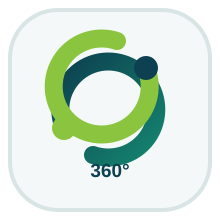
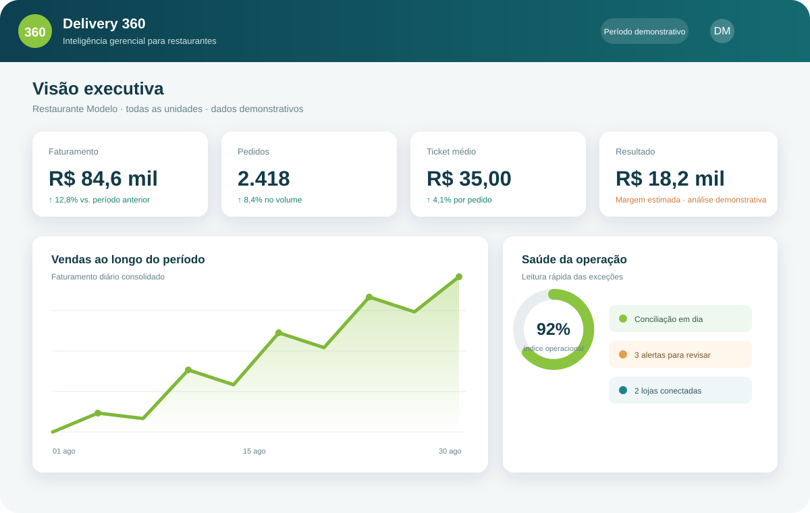
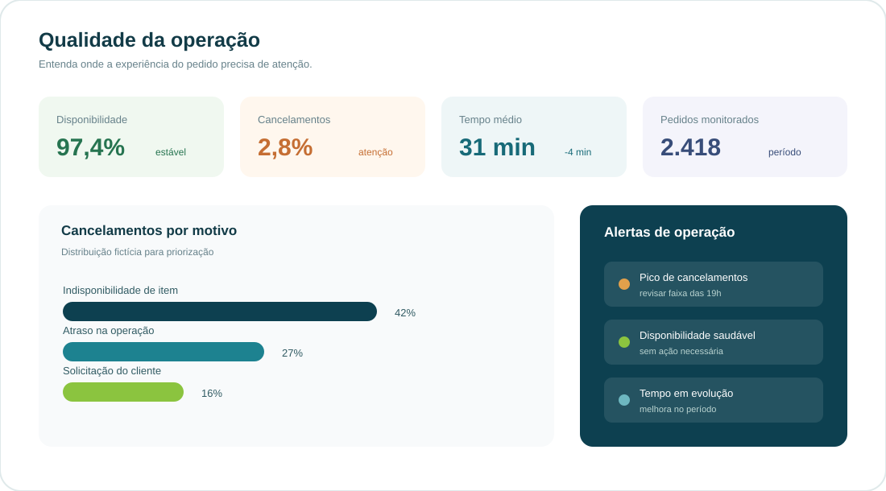
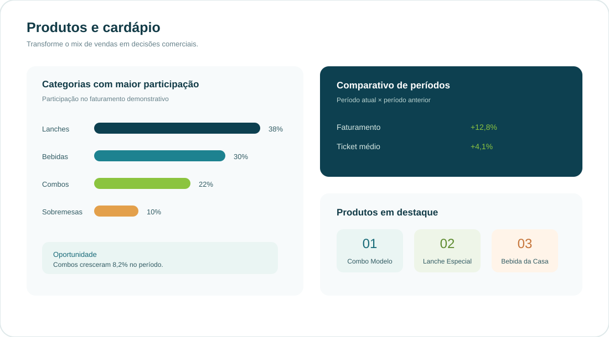
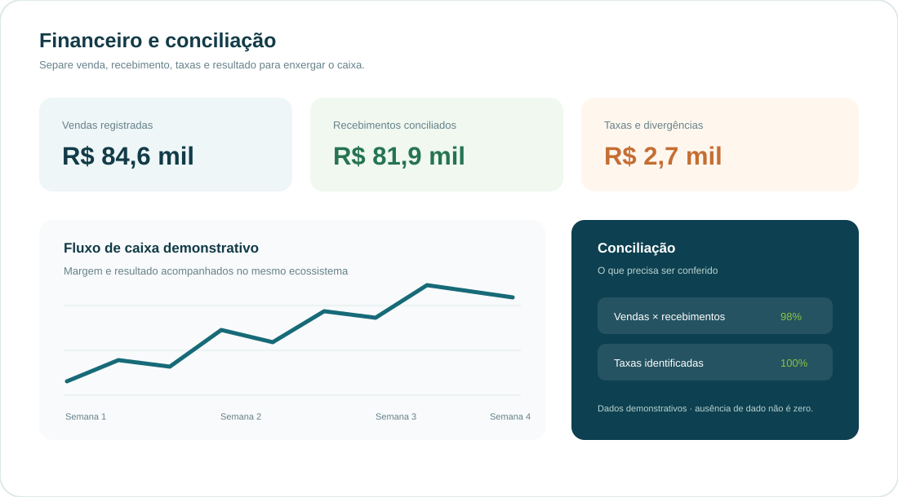
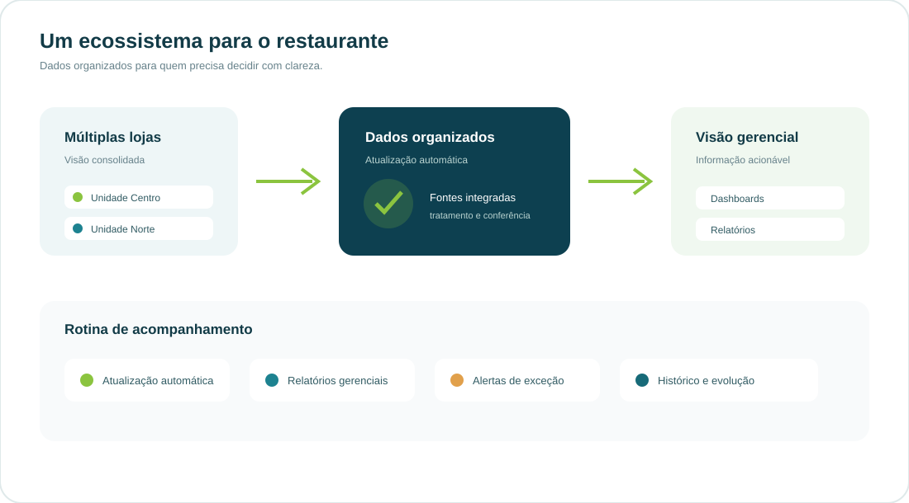

  
  <h1>Delivery 360</h1>
  
<strong>Inteligência gerencial para restaurantes, desenvolvida pela Rico Soluções Inteligentes.</strong>

  
Uma visão clara para transformar dados de delivery em decisões melhores.

O Delivery 360 é uma plataforma de inteligência gerencial para restaurantes que precisam entender melhor suas vendas, sua operação e seus resultados. Em vez de obrigar o proprietário a navegar por vários menus e relatórios de diferentes plataformas, o ecossistema organiza os dados e apresenta os indicadores em uma linguagem executiva, direta e compreensível.

A solução foi pensada a partir de necessidades reais de operações de delivery. Projetos diferentes podem exigir módulos diferentes, por isso o Delivery 360 combina um núcleo executivo com capacidades que podem ser ativadas conforme o perfil do restaurante, a quantidade de lojas, as plataformas utilizadas e o nível de controle desejado.

## O que o proprietário consegue enxergar

A primeira camada reúne os números que ajudam a responder as perguntas mais importantes do negócio: quanto vendeu, quantos pedidos recebeu, qual foi o ticket médio, como a operação se comportou, quanto foi efetivamente recebido e qual foi o resultado observado no período.

### Operação e qualidade

O módulo operacional transforma ocorrências espalhadas em uma leitura de prioridades. Disponibilidade, cancelamentos, tempo médio, desempenho e alertas aparecem lado a lado para que a equipe consiga identificar exceções e agir antes que elas se repitam.

### Vendas, produtos e cardápio

A visão comercial mostra quais categorias participam mais do resultado, quais produtos merecem atenção, como o ticket evolui e quais horários ou períodos apresentam oportunidades. A ideia não é apenas mostrar o que vendeu, mas ajudar a interpretar o mix do restaurante.

### Financeiro e conciliação

O Delivery 360 separa faturamento, recebimentos, taxas, divergências, margem e resultado. Essa separação é importante porque vender não significa necessariamente receber o mesmo valor no mesmo momento. A conciliação organiza essa diferença e facilita a leitura do fluxo de caixa. Os números apresentados aqui são demonstrativos, e ausência de dado não é tratada como zero.

### Múltiplas lojas, fontes e relatórios

Quando o restaurante possui mais de uma unidade ou trabalha com diferentes fontes de venda, a plataforma pode consolidar os dados em uma visão geral e, ao mesmo tempo, permitir o detalhamento por loja, período e origem. Atualizações automatizadas, relatórios gerenciais, alertas de exceção e histórico de evolução completam o ecossistema.

## Uma plataforma que traduz complexidade

As plataformas de delivery são importantes para a operação, mas seus dados costumam estar distribuídos em telas, indicadores e relatórios que nem sempre conversam entre si. O Delivery 360 atua como uma camada de organização e interpretação. Ele reúne os dados disponíveis, trata as diferenças, estrutura os indicadores e entrega uma visão adequada ao momento de decisão.

O resultado é um painel que pode ser usado pelo proprietário, pelo sócio, pelo gestor financeiro ou pela equipe operacional. Cada perfil pode encontrar a informação que precisa sem perder a visão geral do restaurante.

## Possibilidades de implantação

- visão executiva por período;
- análise de vendas, pedidos e ticket médio;
- qualidade da operação e acompanhamento de cancelamentos;
- produtos, categorias e desempenho do cardápio;
- recebimentos, taxas, conciliação e fluxo de caixa;
- comparação entre lojas, períodos e fontes de venda;
- relatórios gerenciais e alertas de exceção;
- atualização automatizada conforme o desenho da operação;
- evolução dos indicadores ao longo do tempo.

A composição final depende da realidade de cada cliente. Alguns restaurantes precisam começar pela leitura financeira. Outros precisam controlar operação, cardápio, múltiplas unidades ou conciliação. O Delivery 360 foi pensado para acomodar essas diferenças sem perder a clareza da visão executiva.

## Sobre esta demonstração

Este repositório apresenta a capacidade técnica e a proposta visual do Delivery 360. As imagens, nomes, números e indicadores são fictícios, fazem parte de dados demonstrativos e foram criados exclusivamente para demonstração. O showcase não contém código, dados, capturas, credenciais ou informações operacionais dos aplicativos privados que deram origem às necessidades do produto.

<strong>Delivery 360</strong> Dados organizados. Gestão mais clara. Decisões melhores.

Desenvolvido pela <strong>Rico Soluções Inteligentes</strong>.

